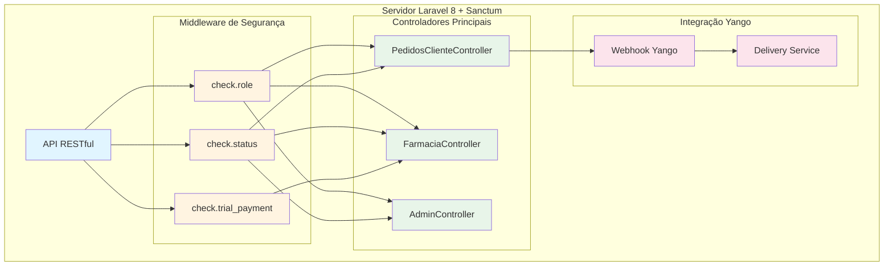
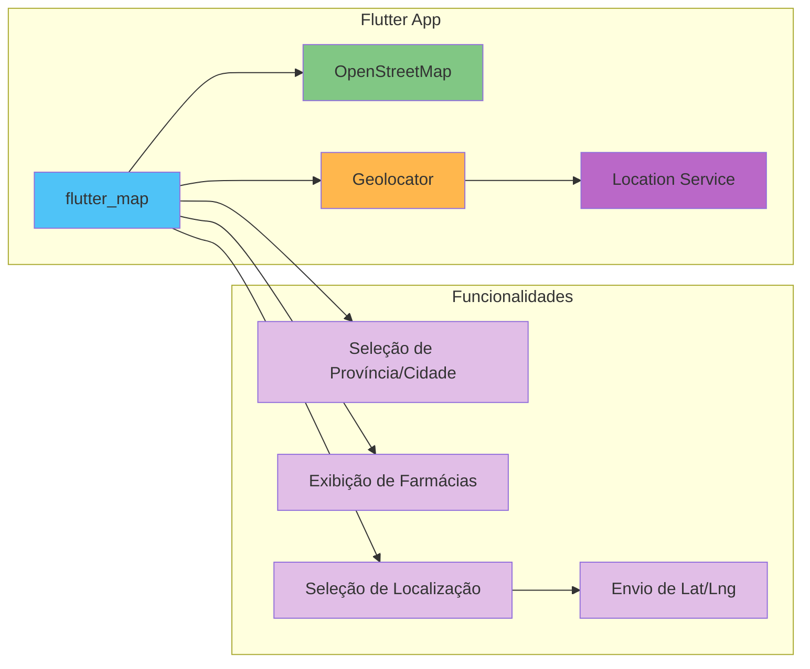
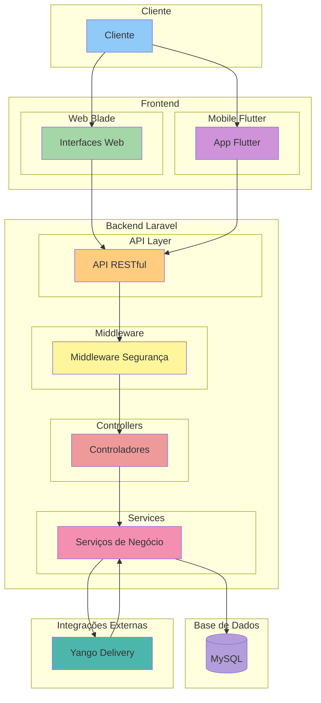
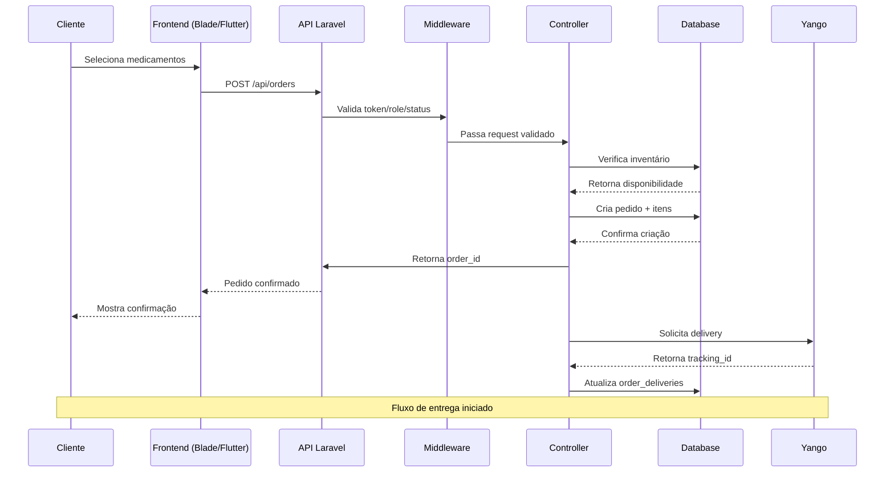
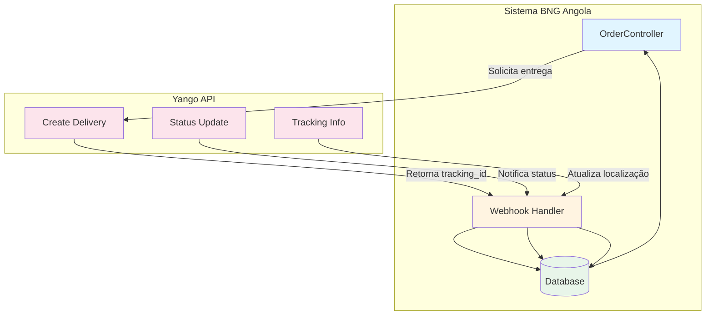

# Arquitetura

## Padrão arquitetural
- Aplicação baseada em **MVC** (Laravel):
  - **Controllers**: recebem requests, validam dados, coordenam ações.
  - **Models**: acesso a dados e regras de domínio (ex.: cálculos).
  - **Views**: Blade.

## Módulos principais (por responsabilidade)
- **Admin**
  - `app/Http/Controllers/Admin/*`
  - Views em `resources/views/admin/*`
- **Farmácia**
  - `app/Http/Controllers/Pharmacy/*`
  - Views em `resources/views/pharmacy/*`

## Gestão de ficheiros (documentos)
- Uploads são guardados tipicamente em `storage/app/...` via `Storage::disk('local')`.
- Exemplos:
  - Alvará de farmácia: `pharmacies/alvara_documents`
  - Documentos de filiais: `pharmacy_branches/documents`

## Regras críticas (referência)
- Mensalidade dinâmica:
  - Centralizada em `Pharmacy::calculateMonthlyAmountV7()`.
  - Matriz soma o base + mensalidades de filiais ativas/aprovadas.

---

# Diagrama da Arquitetura Geral do Sistema BNG Angola

## Camada 1 — Base de Dados (Data Layer)

```mermaid
erDiagram
    users ||--o{ pharmacies : "gerencia"
    users ||--o{ orders : "realiza"
    users ||--o{ notifications : "recebe"
    users ||--o{ activity_logs : "gera"

    pharmacies ||--o{ pharmacy_branches : "possui"
    pharmacies ||--o{ medicines : "cadastra"
    pharmacies ||--o{ monthly_fees : "paga"
    pharmacies ||--o{ orders : "processa"

    pharmacy_branches ||--o{ medicine_inventories : "mantém"
    pharmacy_branches ||--o{ orders : "atende"

    medicines ||--o{ medicine_inventories : "tem"
    medicines ||--o{ order_items : "incluído"

    orders ||--o{ order_items : "contém"
    orders ||--o{ order_payments : "pagamento"
    orders ||--o{ order_deliveries : "entrega"

    users {
        bigint id PK
        string name
        string email
        string password
        string role "admin|pharmacy|customer"
        string status "active|inactive|trial"
        timestamp email_verified_at
        timestamps
    }

    pharmacies {
        bigint id PK
        bigint user_id FK
        string name
        string license_number
        string address
        string province
        string city
        decimal latitude
        decimal longitude
        string status "pending|approved|rejected|active"
        string alvara_document
        timestamps
    }

    pharmacy_branches {
        bigint id PK
        bigint pharmacy_id FK
        string name
        string address
        string province
        string city
        decimal latitude
        decimal longitude
        string status "active|inactive"
        timestamps
    }

    medicines {
        bigint id PK
        bigint pharmacy_id FK
        string name
        string description
        string manufacturer
        string category
        decimal price
        timestamps
    }

    medicine_inventories {
        bigint id PK
        bigint medicine_id FK
        bigint pharmacy_branch_id FK
        integer quantity
        string batch_number
        date expiry_date
        timestamps
    }

    orders {
        bigint id PK
        bigint user_id FK
        bigint pharmacy_branch_id FK
        string status "pending|confirmed|preparing|ready|delivered|cancelled"
        decimal total_amount
        string delivery_address
        decimal delivery_lat
        decimal delivery_lng
        timestamps
    }

    order_items {
        bigint id PK
        bigint order_id FK
        bigint medicine_id FK
        integer quantity
        decimal unit_price
        decimal subtotal
        timestamps
    }

    order_payments {
        bigint id PK
        bigint order_id FK
        string payment_method "cash|card|transfer"
        decimal amount
        string status "pending|completed|failed"
        timestamps
    }

    order_deliveries {
        bigint id PK
        bigint order_id FK
        string delivery_service "yango|internal"
        string tracking_id
        string status "pending|assigned|in_transit|delivered"
        timestamps
    }

    monthly_fees {
        bigint id PK
        bigint pharmacy_id FK
        decimal amount
        string month
        string year
        string status "pending|paid|overdue"
        timestamps
    }

    notifications {
        bigint id PK
        bigint user_id FK
        string title
        string message
        string type "info|warning|error"
        boolean is_read
        timestamps
    }

    activity_logs {
        bigint id PK
        bigint user_id FK
        string action
        string model_type
        bigint model_id
        json changes
        timestamps
    }

    database_backups {
        bigint id PK
        string filename
        string path
        bigint size
        string status "completed|failed"
        timestamps
    }
```

## Camada 2 — Backend (Servidor Laravel)



### Endpoints API RESTful

```mermaid
graph LR
    subgraph "Autenticação"
        A1[POST /api/login]
        A2[POST /api/register]
        A3[POST /api/logout]
    end
    
    subgraph "Farmácias"
        F1[GET /api/pharmacies]
        F2[POST /api/pharmacies]
        F3[GET /api/pharmacies/{id}]
        F4[PUT /api/pharmacies/{id}]
        F5[GET /api/pharmacies/{id}/branches]
    end
    
    subgraph "Medicamentos"
        M1[GET /api/medicines]
        M2[GET /api/pharmacies/{id}/medicines]
        M3[GET /api/medicines/search]
    end
    
    subgraph "Pedidos"
        O1[POST /api/orders]
        O2[GET /api/orders]
        O3[GET /api/orders/{id}]
        O4[PUT /api/orders/{id}/status]
        O5[POST /api/orders/{id}/payment]
    end
    
    subgraph "Admin"
        AD1[GET /api/admin/users]
        AD2[GET /api/admin/pharmacies]
        AD3[PUT /api/admin/pharmacies/{id}/approve]
        AD4[GET /api/admin/analytics]
    end
    
    style A1 fill:#e3f2fd
    style A2 fill:#e3f2fd
    style A3 fill:#e3f2fd
    style F1 fill:#f3e5f5
    style F2 fill:#f3e5f5
    style F3 fill:#f3e5f5
    style F4 fill:#f3e5f5
    style F5 fill:#f3e5f5
    style M1 fill:#e8f5e9
    style M2 fill:#e8f5e9
    style M3 fill:#e8f5e9
    style O1 fill:#fff3e0
    style O2 fill:#fff3e0
    style O3 fill:#fff3e0
    style O4 fill:#fff3e0
    style O5 fill:#fff3e0
    style AD1 fill:#fce4ec
    style AD2 fill:#fce4ec
    style AD3 fill:#fce4ec
    style AD4 fill:#fce4ec
```

## Camada 3 — Frontend Web (Blade) e Mobile (Flutter)

```mermaid
graph TB
    subgraph "Frontend Web (Blade)"
        subgraph "Interfaces Cliente"
            W1[Landing Page]
            W2[Busca de Medicamentos]
            W3[Criação de Pedido]
            W4[Acompanhamento de Pedido]
        end
        
        subgraph "Interfaces Farmácia"
            W5[Painel Farmácia]
            W6[Gestão de Inventário]
            W7[Gestão de Pedidos]
        end
        
        subgraph "Interfaces Admin"
            W8[Painel Admin]
            W9[Gestão de Farmácias]
            W10[Analytics e Relatórios]
        end
    end
    
    subgraph "Mobile (Flutter)"
        subgraph "Módulos Cliente"
            F1[Tela de Login]
            F2[Listagem de Farmácias]
            F3[Mapa de Geolocalização]
            F4[Busca de Medicamentos]
            F5[Carrinho/Pedido]
        end
        
        subgraph "Módulos Farmácia"
            F6[Dashboard Farmácia]
            F7[Gestão de Estoque]
            F8[Notificações de Pedido]
        end
    end
    
    subgraph "Comunicação API"
        API[API RESTful]
    end
    
    W1 --> API
    W2 --> API
    W3 --> API
    W4 --> API
    W5 --> API
    W6 --> API
    W7 --> API
    W8 --> API
    W9 --> API
    W10 --> API
    
    F1 --> API
    F2 --> API
    F3 --> API
    F4 --> API
    F5 --> API
    F6 --> API
    F7 --> API
    F8 --> API
    
    style W1 fill:#e1f5ff
    style W2 fill:#e1f5ff
    style W3 fill:#e1f5ff
    style W4 fill:#e1f5ff
    style W5 fill:#fff4e1
    style W6 fill:#fff4e1
    style W7 fill:#fff4e1
    style W8 fill:#fce4ec
    style W9 fill:#fce4ec
    style W10 fill:#fce4ec
    style F1 fill:#e8f5e9
    style F2 fill:#e8f5e9
    style F3 fill:#e8f5e9
    style F4 fill:#e8f5e9
    style F5 fill:#e8f5e9
    style F6 fill:#f3e5f5
    style F7 fill:#f3e5f5
    style F8 fill:#f3e5f5
    style API fill:#ffecb3
```



### Detalhes do Módulo Flutter - Mapa de Geolocalização



## Camada 4 — Fluxo Geral Consolidado



### Fluxo Detalhado de Criação de Pedido



### Fluxo de Integração Yango (Webhook)



---

## Resumo Tecnológico

| Camada | Tecnologia | Descrição |
|--------|------------|-----------|
| **Database** | MySQL | Sistema de gestão de base de dados relacional |
| **Backend** | Laravel 8 + Sanctum | Framework PHP com autenticação via tokens |
| **Frontend Web** | Blade Templates | Views do Laravel para interfaces web |
| **Frontend Mobile** | Flutter + flutter_map | App cross-platform com mapa OpenStreetMap |
| **API** | RESTful | Comunicação entre frontend e backend |
| **Integração** | Yango Webhook | Serviço de entrega externo |
| **Segurança** | Middleware (role, status, trial) | Controle de acesso e validações |
