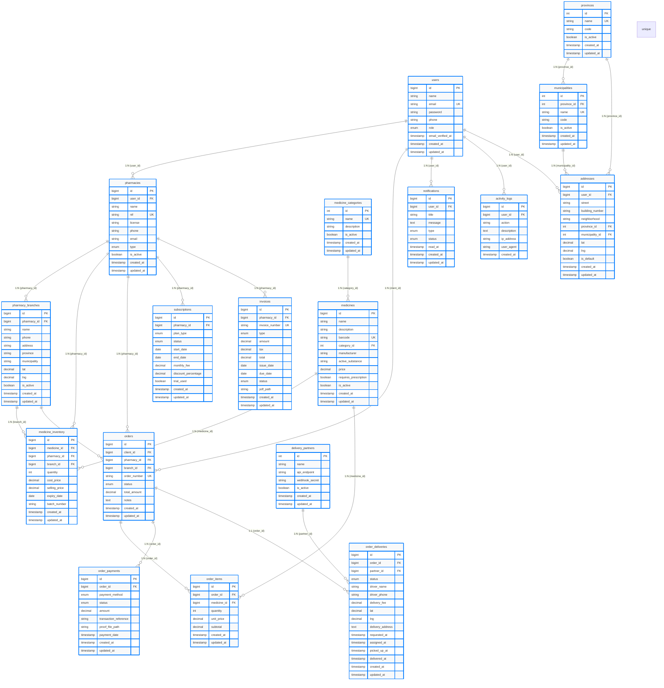

# Figura 6 - Diagrama Entidade-Relacionamento (DER) completo da base de dados

## Legenda

**PK** = Chave Primária  
**FK** = Chave Estrangeira  
**UK** = Chave Única  
**1:N** = Um-para-muitos  
**1:1** = Um-para-um

## Descrição dos Grupos de Entidades

### Grupo Utilizadores
- **users**: Utilizadores do sistema (clientes, farmácias, administradores)
- **pharmacies**: Dados das farmácias (matriz e filiais)
- **pharmacy_branches**: Filiais das farmácias com localização

### Grupo Produtos
- **medicine_categories**: Categorias de medicamentos
- **medicines**: Catálogo de medicamentos
- **medicine_inventory**: Stock disponível por farmácia/filial

### Grupo Pedidos
- **orders**: Pedidos dos clientes
- **order_items**: Items de cada pedido
- **order_payments**: Registo de pagamentos

### Grupo Entregas
- **delivery_partners**: Parceiros de transporte (Yango, etc.)
- **order_deliveries**: Detalhes da entrega de cada pedido

### Grupo Sistema
- **notifications**: Notificações para utilizadores
- **activity_logs**: Registo de auditoria
- **subscriptions**: Subscrições/mensalidades das farmácias
- **invoices**: Facturas emitidas

### Grupo Configuração
- **provinces**: Províncias de Angola
- **municipalities**: Municípios por província
- **addresses**: Endereços dos utilizadores

## Total de Tabelas: 19
