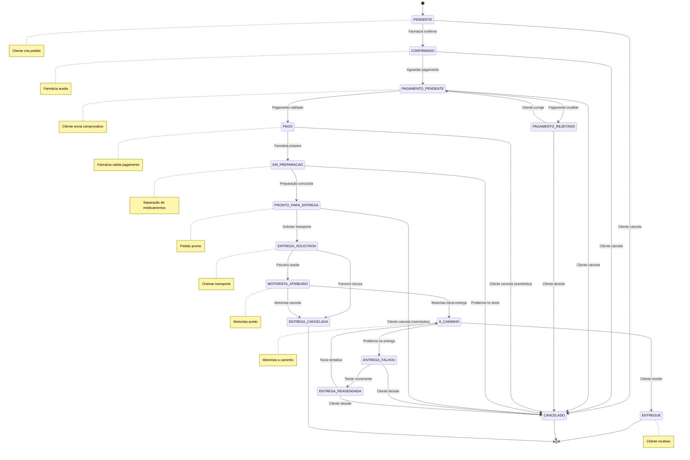
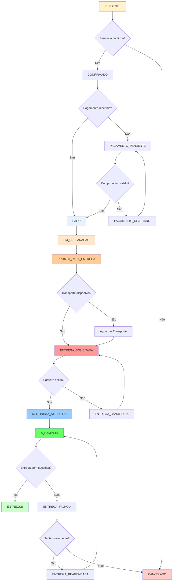

# Diagramas de Pedido - Plataforma BNG Angola

## Figura  - Fluxo de Estados do Pedido

## Figura 8 - Ciclo de Vida do Pedido (Timeline)

```mermaid
gantt
    title Ciclo de Vida do Pedido - Timeline
    dateFormat HH:mm
    axisFormat %H:%M
    
    section Cliente
    Cria Pedido           :milestone, m1, 09:00, 0min
    Envia Comprovativo     :milestone, m2, 09:15, 0min
    Recebe Pedido         :milestone, m3, 12:30, 0min
    
    section Farmácia
    Confirma Pedido       :a1, 09:05, 10min
    Valida Pagamento      :a2, after a1, 20min
    Prepara Medicamentos  :a3, after a2, 2h
    Solicita Transporte   :a4, after a3, 5min
    
    section Pagamento
    Processamento         :b1, 09:15, 15min
    Validação             :b2, after b1, 10min
    
    section Transporte
    Aceitação             :c1, after a4, 10min
    Motorista Atribuído   :c2, after c1, 5min
    Recolhe Pedido        :c3, after c2, 15min
    Entrega em Curso      :c4, after c3, 45min
    Pedido Entregue       :milestone, m4, 12:30, 0min
    
    section Sistema
    Notificação Cliente   :d1, 09:05, 2min
    Notificação Farmácia  :d2, 09:15, 2min
    Notificação Pagamento :d3, 09:30, 2min
    Notificação Transporte: d4, 11:20, 2min
    Notificação Entrega   :d5, 12:30, 2min
```

## Figura 9 - Detalhamento dos Estados do Pedido

## Tabela 9 - Estados do Pedido e Transições Permitidas

| Estado Atual | Estado Seguinte | Condição | Responsável |
|--------------|-----------------|----------|-------------|
| PENDENTE | CONFIRMADO | Farmácia aceita pedido | Farmácia |
| PENDENTE | CANCELADO | Cliente cancela | Cliente |
| CONFIRMADO | PAGAMENTO_PENDENTE | Aguardar pagamento | Sistema |
| CONFIRMADO | CANCELADO | Cliente cancela | Cliente |
| PAGAMENTO_PENDENTE | PAGO | Pagamento validado | Farmácia |
| PAGAMENTO_PENDENTE | PAGAMENTO_REJEITADO | Comprovativo inválido | Farmácia |
| PAGAMENTO_PENDENTE | CANCELADO | Cliente desiste | Cliente |
| PAGAMENTO_REJEITADO | PAGAMENTO_PENDENTE | Cliente envia novo | Cliente |
| PAGO | EM_PREPARACAO | Iniciar preparação | Farmácia |
| PAGO | CANCELADO | Cliente cancela (reembolso) | Cliente |
| EM_PREPARACAO | PRONTO_PARA_ENTREGA | Preparação concluída | Farmácia |
| EM_PREPARACAO | CANCELADO | Problema no stock | Farmácia |
| PRONTO_PARA_ENTREGA | ENTREGA_SOLICITADA | Chamar transporte | Sistema |
| PRONTO_PARA_ENTREGA | CANCELADO | Cliente cancela | Cliente |
| ENTREGA_SOLICITADA | MOTORISTA_ATRIBUIDO | Parceiro aceita | Parceiro |
| ENTREGA_SOLICITADA | ENTREGA_CANCELADA | Parceiro recusa | Parceiro |
| MOTORISTA_ATRIBUIDO | A_CAMINHO | Motorista inicia | Motorista |
| MOTORISTA_ATRIBUIDO | ENTREGA_CANCELADA | Motorista cancela | Motorista |
| A_CAMINHO | ENTREGUE | Cliente recebe | Cliente |
| A_CAMINHO | ENTREGA_FALHOU | Problema na entrega | Motorista |
| ENTREGA_FALHOU | ENTREGA_REAGENDADA | Tentar novamente | Sistema |
| ENTREGA_FALHOU | CANCELADO | Cliente desiste | Cliente |
| ENTREGA_REAGENDADA | A_CAMINHO | Nova tentativa | Motorista |

## Descrição dos Estados

### Estados Ativos
- **PENDENTE**: Pedido criado, aguardando confirmação da farmácia
- **CONFIRMADO**: Farmácia aceitou, aguardando pagamento
- **PAGAMENTO_PENDENTE**: Aguardando validação do comprovativo
- **PAGO**: Pagamento validado, iniciar preparação
- **EM_PREPARACAO**: Medicamentos sendo separados
- **PRONTO_PARA_ENTREGA**: Pedido pronto para transporte
- **ENTREGA_SOLICITADA**: Transporte solicitado ao parceiro
- **MOTORISTA_ATRIBUIDO**: Motorista aceitou a entrega
- **A_CAMINHO**: Motorista a caminho do cliente

### Estados Finais
- **ENTREGUE**: Pedido entregue com sucesso
- **CANCELADO**: Pedido cancelado por cliente ou farmácia
- **ENTREGA_CANCELADA**: Transporte cancelado pelo parceiro
- **ENTREGA_FALHOU**: Problema na entrega
- **ENTREGA_REAGENDADA**: Nova tentativa de entrega agendada

### Estados Temporários
- **PAGAMENTO_REJEITADO**: Comprovativo inválido, aguardando correção
